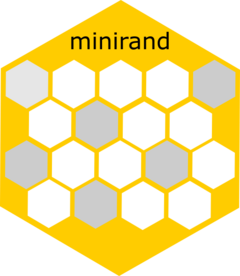

<!-- README.md is generated from README.Rmd. Please edit that file -->

```{r, include = FALSE}
knitr::opts_chunk$set(
  collapse = TRUE,
  comment = "#>",
  fig.path = "man/figures/README-",
  out.width = "100%"
)
```

# multimini 

<!-- badges: start -->
[](https://lifecycle.r-lib.org/articles/stages.html#experimental)
<!-- badges: end -->

The goal of `multimini` is to use minimisation to randomise a multi-arm trial with various different techniques for the minimisation probabilities.

## Installation

You can install the development version of `multimini` from [GitHub](https://github.com/) with:

``` r
# install.packages("devtools")
devtools::install_github("EstherHerbert/multimini")
```

## Examples

### Using the default minimisation probabilities

This is a basic example which shows you how to solve a common problem:

``` r
library(multimini)

(mini <- minimise(patients, groups = 3, factors = c("sex", "stage"), 
                  burnin = 15))

balance(mini)
```

### Specifying minimisation probabilities

``` r
(mini <- minimise(patients, groups = 3, factors = c("sex", "stage"),
                  burnin = 15, minprob = c(0.8, 0.2, 0)))

balance(mini)
```
### Using stratification

``` r
(mini_s <- minimise(patients, groups = 3, factors = c("sex", "stage"),
                    burnin = 5, stratify = "site"))

balance(mini_s)
```
